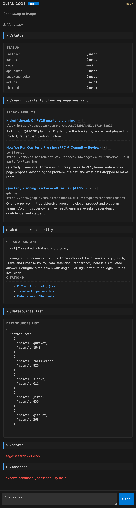
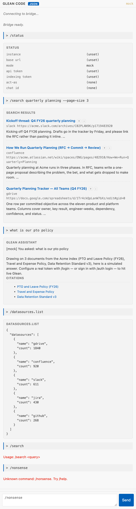

# Glean Code — VS Code extension(s)

A Glean assistant in your sidebar: chat, search, and the admin commands from
[`glean-code-cli`](https://github.com/barkz/glean-code-cli), rendered as cards
in a VS Code panel.

Two extensions live here. They solve the same problem two ways against the same
CLI. **[version-2-json-bridge](version-2-json-bridge/) is the one to install.**

| | Dark | Light |
| --- | --- | --- |
| |  |  |

<sub>Both images are generated from [docs/sessions/getting-started.md](docs/sessions/getting-started.md)
by `tools/replay.mjs`, using the extension's own renderer. See [docs/REPLAY.md](docs/REPLAY.md).</sub>

## Install

```bash
git clone https://github.com/barkz/glean-code-vscode-extension.git
cd glean-code-vscode-extension
./install.sh
```

That builds a `.vsix` and installs it into every VS Code and Cursor it finds on
your `PATH`, then checks whether the extension will be able to reach the CLI.
Open the panel with **Cmd+Alt+G** (Ctrl+Alt+G on Windows/Linux).

```bash
./install.sh --version 1        # install the REPL version instead
./install.sh --editor cursor    # only Cursor
./install.sh --package-only     # just build the .vsix
./install.sh --uninstall
```

### Requirements

- **Node 18+** — to compile and package.
- **Python 3.9+** — the extension spawns it to talk to Glean.
- **`glean_code`** reachable by that interpreter. No pip install needed; the
  extension looks in several places (below).
- **No credentials required to try it.** Without a token the CLI serves a
  built-in mock corpus, which is what the screenshots show.

### How the extension finds the CLI

In order, stopping at the first hit:

1. The `gleanCodeBridge.cliPath` setting (`gleanCode.cliPath` for v1).
2. `GLEAN_CODE_HOME`.
3. Whether your `python3` can already `import glean_code`.
4. The zipapp `python3 install.py` installs at `~/.local/bin/glean`.
5. A `glean-code-cli` clone in or beside your workspace.

The simplest setup is to run `python3 install.py` once in your `glean-code-cli`
checkout — that covers case 4 and the extension needs no configuration at all.

If none match, the panel tells you what it tried and offers to open Settings.

## Connecting to a real instance

```
/login --instance acme-be.glean.com --token <your-token>
/status
```

`/mode live|mock|auto` switches between a real tenant and the mock corpus.

## The two versions

| | [Version 1: REPL](version-1-repl/) | [Version 2: JSON bridge](version-2-json-bridge/) |
| --- | --- | --- |
| What runs in Python | `python3 -m glean_code` (the full REPL) | `python/glean_bridge.py` importing `glean_code.client` |
| Wire format | Raw stdout/stderr, line-buffered, ANSI-stripped | Newline-delimited JSON request/response |
| UI rendering | One scrollback pane, plain text | Structured cards per method |
| Citations / tracking tokens | Lost in the prose | First-class fields, used to wire feedback buttons |
| Status bar | Not visible (the REPL only prints it under a TTY) | In the panel header, updated on `/status`, `/login`, `/mode` |
| Survives CLI output changes | No — column widths and banners are part of the contract | Yes — the contract is the JSON |
| Errors | Mixed into stdout/stderr text | Per-request `id` plus an `error` field |
| Cost of a new command | Add to the slash list, hope the output parses | Bridge method + `parseLine` case + renderer |

**Pick v1** if you treat the CLI as the single source of truth and want no
duplication — every REPL command shows up for free. You pay for it in
brittleness.

**Pick v2** if you want to do anything with the data: cards, buttons, citation
links, per-result feedback. You keep the bridge methods in sync with
`glean_code.client` in exchange for a real API surface.

Both are a Glean assistant pane — chat, search and admin commands. Neither does
inline code completion or agentic file editing.

## Development

```bash
cd version-2-json-bridge
npm install
npm run compile
npm test              # integration test inside a real VS Code extension host
npm run package       # -> dist/glean-code-bridge-0.1.0.vsix
```

Press **F5** in either extension folder to launch an Extension Development Host.

Screenshots and session transcripts are generated — see
[docs/REPLAY.md](docs/REPLAY.md):

```bash
node tools/record.mjs --name my-demo '/status' '/search onboarding'
node tools/replay.mjs
```

[CLAUDE.md](CLAUDE.md) documents the architecture and the conventions worth
knowing before changing anything.

## Layout

```
install.sh                  build + install a .vsix
CLAUDE.md                   architecture and conventions
tools/                      record.mjs, replay.mjs, test-extension.sh
docs/
  REPLAY.md                 session file format
  sessions/                 recorded sessions (readable + replayable)
  img/                      screenshots generated from them
version-1-repl/             scrape-the-REPL extension
version-2-json-bridge/      JSON-RPC extension + Python bridge
```

## License

MIT — see [LICENSE](LICENSE).
